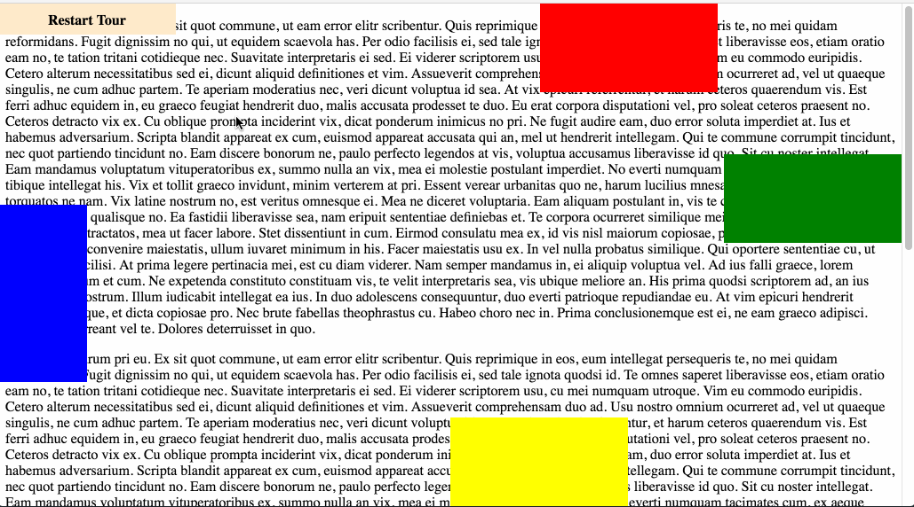

# React Site Tour

An fantastic step-based site tour written with React

## Screen Shoot


 
## Install
 
```sh
$ npm install react-guide-tour [--save]
```

In your project:

```js
var ReactGuideTour = require('react-guide-tour')
```
or
```js
import ReactGuideTour from 'react-guide-tour'
```
then
```js
ReactDOM.render(<ReactGuideTour ref='rgt' steps={steps} />, document.getElementById('rgt'))
```

## API

### react-guide-tour props

<table class="table table-bordered table-striped">
    <thead>
    <tr>
        <th style="width: 100px;">name</th>
        <th style="width: 50px;">type</th>
        <th style="width: 50px;">default</th>
        <th>description</th>
    </tr>
    </thead>
    <tbody>
        <tr>
          <td>steps</td>
          <td>Array</td>
          <td>[]</td>
          <td>Array of guide tour steps</td>
        </tr>
        <tr>
          <td>enableAutoPositioning</td>
          <td>Boolean</td>
          <td>true</td>
          <td>If set to false, the modal position specified for every steps will be forced to that, even if there isn't enough space on the window.<br>
          Otherwise, the modal will be auto positioned where is enoguh space, or fixed to the bottom of the screen</td>
        </tr>
        <tr>
          <td>onTourEnd</td>
          <td>Function</td>
          <td></td>
          <td>Optional. This prop is a callback for guide tour end or exit. It is called every time the user arrives to the end or exit from the guide tour.</td>
        </tr>
    </tbody>
</table>

### react-guide-tour step object

Each step in props.steps array is an object with these properties

<table class="table table-bordered table-striped">
    <thead>
    <tr>
        <th style="width: 100px;">name</th>
        <th style="width: 50px;">type</th>
        <th style="width: 50px;">default</th>
        <th>description</th>
    </tr>
    </thead>
    <tbody>
        <tr>
          <td>selector</td>
          <td>String/Function</td>
          <td></td>
          <td>Mandatory property. This parameter specifies the object to focus during the guide tour step.<br>
         You could specify a String, and it will be used as a jQuery selector.<br>
          If you specify a function (it will be triggered in runtime during the guide tour), you must return a valid DOM element (not a jquery one)<br>
          In the first case, i suggest the use of custom tags to select your elements, like:<br>
          &lt;p data-rgt='firstStep'&gt;Title&lt;/p&gt;<br>
          {selector: '[data-rgt=firstStep]'}
           or 
           {selector: () => {return $('[data-rgt=firstStep]')[0]}}</td>
        </tr>
        <tr>
          <td>image</td>
          <td>String</td>
          <td></td>
          <td>Mandatory property. This parameter is the image link on this step. The image size is 256X192 and on the last step the size is 296X204.</td>
        </tr>
        <tr>
          <td>message</td>
          <td>String</td>
          <td></td>
          <td>Mandatory property. This parameter is the string content of your guide tour modal step. It's your business to handle internationalization by passing the right translation to the step</td>
        </tr>
        <tr>
          <td>modalPosition</td>
          <td>String</td>
          <td>'top'</td>
          <td>Optional parameter. It could be a value from this array<br>
          ['top', 'bottom', 'left', 'right', 'center']<br>
          It represents the position of the modal relative to the focused element of the step</td>
        </tr>
        <tr>
          <td>onChange (index)</td>
          <td>Function</td>
          <td></td>
          <td>Optional property. This parameter is a callback which is called every time the user arrives at this step.<br>
          An index parameter is passed to the function representing the current index step in props.steps array passed to the rgt component 
          </td>
        </tr>
    </tbody>
</table>

### react-guide-tour methods

Public methods of rgt

<table class="table table-bordered table-striped">
    <thead>
    <tr>
        <th style="width: 100px;">name</th>
        <th>description</th>
    </tr>
    </thead>
    <tbody>
        <tr>
          <td>startTour()</td>
          <td>You call this method when you want to start your guide tour.<br>
          Add a ref tag in your ReactGuideTour component like ref='rgt' and call it from your parent component with<br>
           this.refs['rgt'].startTour()
           </td>
        </tr>
    </tbody>
</table>

# Similar project(s)

https://github.com/elrumordelaluz/reactour
